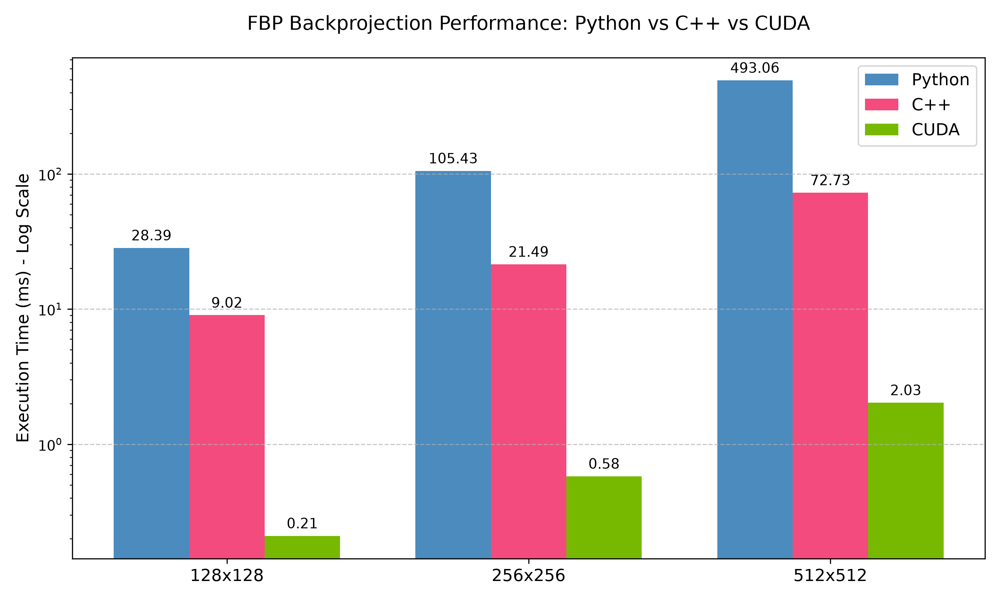

# CT FBP Image Reconstruction Performance Study

## Setup
* OS: Ubuntu 26.04
* GPU: Nvidia GTX 750 Ti
* CUDA Toolkit: 12.4
* Target Architecture: sm_50
* Build Tools: CMake

### Relevant Commands

```bash
nvidia-smi
nvcc --version
nvcc --list-gpu-arch | grep 50
nvcc --list-gpu-code | grep 50
```

## Theory

### The FBP Pipeline Overview
Computed Tomography (CT) reconstructs internal structures by measuring X-ray attenuation. In a foundational parallel-beam geometry, simulated X-rays travel perfectly parallel to one another, capturing line integrals of the object's attenuation coefficients at various angles to form a view or projection. According to the Fourier Slice Theorem, the 1D Fourier transform of a parallel projection taken at angle $\theta$ equals a line in the 2D Fourier transform of the original object taken at that same angle. To prevent the severe radial blurring that naturally occurs when backprojecting this data, the algorithm first applies a ramp filter to the projections in the frequency domain. This filtering acts as a mathematical deconvolution process that prefers high-frequency contents, suppressing the low-frequency blurring artifacts prior to reconstruction.

### Filtered Backprojection Mathematics
The backprojection process essentially reverses the projection process and formulates a 2D object from a set of 1D line integrals. Mathematically, the continuous reconstructed image $f(x,y)$ is obtained by integrating the filtered projections $g$ over the angular range of $0$ to $\pi$:

$$f(x,y)=\int_{0}^{\pi}g(x \cos\theta + y \sin\theta)d\theta$$

The variable $x \cos\theta + y \sin\theta$ represents the distance from the point $(x,y)$ to a straight line passing through the origin at angle $\theta$. This equation states that the reconstructed image $f(x,y)$ at location $(x,y)$ is simply the summation of all filtered projection samples that pass through that specific point. The intensity of the filtered projection sample is "painted" or added uniformly to the reconstructed image along its entire straight-line path.

### Discrete Pixel-Driven Implementation

In any computer implementation, neither the measured projection waveform nor the reconstructed 2D image is continuous. Because the mapped intersection location of a discrete image pixel generally does not line up directly with the discrete samples of the projection array, interpolation is required. 

Our implementations utilize a pixel-driven backprojection approach. The algorithm iterates over every image pixel and follows the ray path passing through the center of the pixel to locate its exact intersection with the 1D filtered projection. It then applies linear interpolation to accurately estimate the filtered projection sample at that precise location using the nearest adjacent detector bins.

Because computers cannot evaluate infinite continuous angles, the algorithm replaces the continuous integral with a discrete Riemann sum over the specific finite angles where the scanner recorded data. The total integration interval $[0, \pi)$ is divided by the total number of measured projection angles, $N_\theta$, to determine the discrete angular step size, $\Delta\theta$. The continuous angle $\theta$ is replaced by the discrete array of sampled angles $\theta_k$, yielding the following numerical approximation:

$$f(x, y) \approx \frac{\pi}{N_\theta} \sum_{k=0}^{N_\theta - 1} g(x \cos\theta_k + y \sin\theta_k)$$

This mathematical summation directly dictates the architectural mechanics of our Python, C++, and CUDA codebases. The primary loops iterate over each discrete projection angle, physically executing the $\Sigma$ (Sigma) accumulation by adding the newly interpolated projection values to the pixel's running total using the `+=` operator. Once all angles are accumulated, the final output matrix is multiplied by the $\Delta\theta$ scale factor (e.g., `d_theta = np.pi / num_angles`) to accurately finalize the continuous integral approximation.

```
// Initialization
reconstruction_grid = 2D_Array(size, size, default=0.0)
d_theta = PI / num_angles

// Iterate over all sampled projection angles
FOR i = 0 TO num_angles - 1:
    theta = angles[i]
    
    // Iterate over every spatial pixel 
    // (Note: These spatial loops are flattened into concurrent threads in the "CUDA-CT-Reconstruction" file)
    FOR y = 0 TO size - 1:
        FOR x = 0 TO size - 1:
            
            // Map the physical pixel to a continuous 1D detector intersection
            t = (x * cos(theta)) + (y * sin(theta)) + det_center
            
            // Isolate adjacent discrete bins for linear interpolation
            t0 = floor(t)
            t1 = t0 + 1
            
            // Calculate fractional interpolation weights
            wt1 = t - t0
            wt0 = 1.0 - wt1
            
            // The Sigma Accumulation
            IF t0 >= 0 AND t1 < num_detectors:
                reconstruction_grid[y][x] += (sinogram[i][t0] * wt0) + (sinogram[i][t1] * wt1)

// Final delta theta scaling to approximate continuous integration
FOR y = 0 TO size - 1:
    FOR x = 0 TO size - 1:
        reconstruction_grid[y][x] = reconstruction_grid[y][x] * d_theta
```

## Python Baseline

The Python baseline establishes the mathematical ground truth for the CUDA-CT-Reconstruction file using NumPy's vectorized operations. Crucially, it also acts as the data generator for the subsequent C++ and CUDA pipelines by exporting the intermediate mathematical steps as flat binary files, allowing us to isolate and profile strictly the backprojection algorithm later.

### Environment Setup

Ensure your virtual environment is active and install the baseline dependencies:

```bash
source venv/bin/activate
pip install numpy scipy matplotlib scikit-image
```

### Execution

Run the baseline script from the root of the repository:

```bash
python src/python/fbp_baseline.py
```

### Pipeline Steps & Outputs

When executed, the script automatically sweeps through three benchmark resolutions (128x128, 256x256, 512x512) and performs the following operations:

*   **Generation:** Creates a standard synthetic Shepp-Logan phantom.
*   **Forward Projection:** Simulates parallel X-ray beams across 180 projection angles to create a sinogram.
*   **Filtering:** Applies a 1D Ram-Lak ramp filter to the sinogram in the frequency domain.
*   **Backprojection & Validation:** Reconstructs the image and computes Root Mean Squared Error (RMSE) and Mean Absolute Error (MAE) against the original phantom.
*   **Visualization Export:** Saves diagnostic visual confirmation plots (e.g., `python_baseline_512x512.png`) to the `results/` directory.
*   **Binary Data Export:** Saves the raw phantom, the projection angles, and the filtered sinogram as `.bin` files into the `data/` directory.

### Reference Benchmarks

Recorded execution times for the pure Python CPU benchmark:

| Resolution | Forward Projection | Ramp Filtering | Backprojection | Total Pipeline | RMSE |
| :--- | :--- | :--- | :--- | :--- | :--- |
| **128x128** | 247.02 ms | 0.43 ms | 28.39 ms | 275.84 ms | 0.20102 |
| **256x256** | 992.84 ms | 0.79 ms | 105.43 ms | 1099.06 ms | 0.22272 |
| **512x512** | 4083.99 ms | 1.82 ms | 493.06 ms | 4578.86 ms | 0.24108 |

## Base C++ Implementation

The C++ implementation strictly isolates the mathematical bottleneck of the pipeline—the backprojection algorithm—by loading the pre-calculated `filtered_sino` and `angles` binary files generated by the Python baseline. It utilizes a purely sequential CPU execution, but achieves significant speedups over Python by using aggressive CMake compiler optimizations (`-O3`, `-march=native`, `-ffast-math`) and explicit nested spatial loops.

### Compilation

We use CMake to configure the build system and compile the executables. Run the following from the root of the repository:

```bash
mkdir -p build
cd build
cmake ..
make
```

### Execution

After compiling, return to the repository root and run the executable for each target benchmark size. The program accepts the image dimension and the number of projection angles as arguments:

```bash
cd ..
./build/fbp_parallel_cpp 128 180
./build/fbp_parallel_cpp 256 180
./build/fbp_parallel_cpp 512 180
```

### Reference Benchmarks

Recorded execution times for the purely sequential C++ CPU backprojection benchmark:

| Resolution | C++ Backprojection | Speedup vs Python |
| :--- | :--- | :--- |
| **128x128** | 9.02 ms | ~3.1x |
| **256x256** | 21.49 ms | ~4.9x |
| **512x512** | 72.73 ms | ~6.8x |

## CUDA Implementation

The CUDA implementation (`src/cuda/fbp_parallel.cu`) completely eliminates the explicit nested spatial loops used in the sequential C++ baseline by mapping every individual physical pixel directly to a unique GPU thread. This massive parallelization is further accelerated by utilizing fast-math hardware intrinsics (`__cosf`, `__sinf`) on the Streaming Multiprocessors. Efficient device memory management (`cudaMalloc`, `cudaMemcpy`, `cudaFree`) is used to precisely reserve and release VRAM, isolating the backprojection kernel from host memory bottlenecks.

### Compilation

We use CMake to configure the build system and compile the executables. Ensure your `CMakeLists.txt` is configured for your specific target architecture (e.g., `sm_50` for the GTX 750 Ti) and includes the CUDA language declaration.

```bash
# Clean previous build files and compile
mkdir -p build
cd build
rm -rf *
cmake ..
make
```

### Execution

After compiling, run the CUDA executable from the repository root for each target benchmark size. The program accepts the image dimension and the number of projection angles as arguments:

```bash
cd ..
./build/fbp_parallel_cuda 128 180
./build/fbp_parallel_cuda 256 180
./build/fbp_parallel_cuda 512 180
```

### Reference Benchmarks

Recorded execution times for the GPU-accelerated backprojection kernel running on an NVIDIA GTX 750 Ti:

| Resolution | CUDA Backprojection | Speedup vs C++ | Speedup vs Python |
| :--- | :--- | :--- | :--- |
| **128x128** | 0.21 ms | ~43x | ~135x |
| **256x256** | 0.58 ms | ~37x | ~182x |
| **512x512** | 2.03 ms | ~35x | ~242x |

## Performance Conclusion



The data presented in demonstrates that GPU acceleration via CUDA provides a massive, multi-order-of-magnitude performance advantage over sequential CPU implementations for the FBP backprojection algorithm. 

As the image resolution scales to 512x512, the execution times for the sequential spatial loops scale drastically, with the Python baseline maxing out at 493.06 ms. The compiled C++ implementation significantly improves upon the baseline across all resolutions, reducing the 512x512 execution time to 72.73 ms. Ultimately, by mapping individual pixels directly to concurrent GPU threads, the CUDA implementation flattens the computational scaling curve, completing the 512x512 reconstruction in just 2.03 ms. This represents an approximate 242x speedup over Python and a 35x speedup over compiled C++.

## References

Bushberg, J. T., Seibert, J. A., Leidholdt, E. M., & Boone, J. M. (2002). *The essential physics of medical imaging* (2nd ed.). Lippincott Williams & Wilkins.

Hsieh, J. (2009). *Computed tomography: Principles, design, artifacts, and recent advances* (2nd ed.). SPIE Press/Wiley Interscience.

Kirk, D. B., & Hwu, W. M. W. (2022). *Programming massively parallel processors: A hands-on approach* (4th ed.). Morgan Kaufmann.